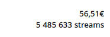

2023/09/23

A few years ago, I gave my distributor permission to distribute the 7 Tempus
Fugit albums on streaming platforms. Last month he informed me that one of my
tracks had been played 5,485,633 times on facebook and that my royalties for
these broadcasts amounted to 56.51€. Two things amaze me about this information:
that one of my tracks was streamed by over 5 million unique listeners in one
month, and that Facebook only owes me €56.51 for these streams.

The track lasts 3min53s, and considering that it has to be listened to more than
80% to be counted (and therefore royalties paid), we're talking about more than
32 years of continuous music!

I remember a time, before streaming, when a radio broadcast of a song brought in
€160 and the mechanical reproduction rights were €5 per CD...

Need we remind facebook that the creation of music, like all intellectual
activities is time-consuming and requires a certain amount of material
resources? It's worrying to see that the streaming platforms so popular with the
younger generation barely pay the artists behind their huge profits.

There's still one place on the internet where you can listen to and buy music
with the guarantee that the musicians who created it are paid a fair wage:
bandcamp. So take a look at what I'm proposing on
[this excellent platform](https://tfugit.bandcamp.com/) and stop using the
streaming platforms that are massacring creation all over the world.
