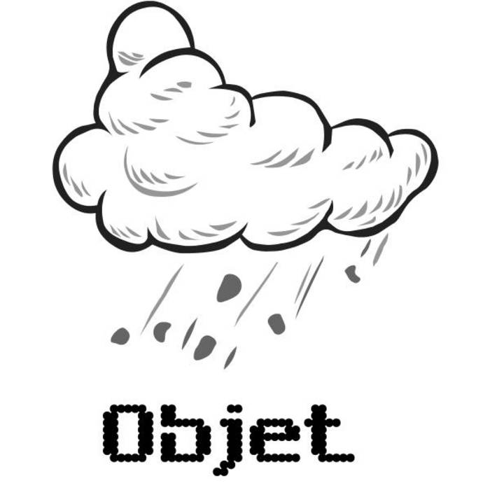

# objet

2013 -

Blending electronic and rock influence, objet musical activities are centered
around guitar playing, live looping and weird home-built sequencers.

(Re-)discovering old and new technology, playing drums, pushing keys and
buttons, hiding some of my favorite musicians into my own creation.

_"A very interesting and worthwhile solo live performance of In C done with
loopers. Any performance of the piece where the fragments are looped loses some
of the excitement of an ensemble performance, but for one person to do this in
one take is remarkable. It works."_ - William Denton / Bandcamp

<iframe style="border: 0; width: 100%; height: 42px;" src="https://bandcamp.com/EmbeddedPlayer/album=3428655801/size=small/bgcol=333333/linkcol=ffffff/track=733528187/transparent=true/" seamless><a href="https://objet.bandcamp.com/album/mono">Mono de Objet</a></iframe>

[bandcamp](https://objet.bandcamp.com/)

<iframe width="560" height="315" src="https://www.youtube.com/embed/3YulFvKGx_Q" title="OBJET, Lyon Loop Jubilee, 14 mai 2014" frameborder="0" allow="accelerometer; autoplay; clipboard-write; encrypted-media; gyroscope; picture-in-picture; web-share" allowfullscreen></iframe>
