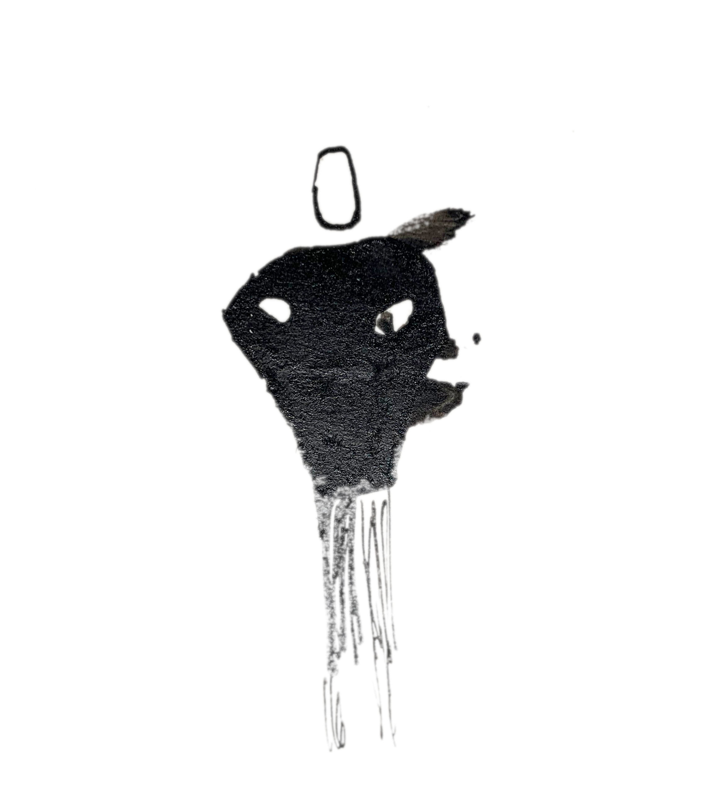

# Rosemary - un roman

## Romusiquan

Rosemary est un roman. Rosemary est une musique. Les deux sont complémentaires
et peuvent se lire et s'écouter en même temps ou bien se lire en silence et
s'écouter sans lire. Rosemary est né entre juin 2021 et juin 2022 d'une volonté
d'écrire du texte et de la musique au rythme d'un chapitre et d'un morceau de
musique par mois (sur une année de 13 mois). Le texte se reflète dans la musique
dont la durée, l'intensité et la construction s'adapte à une vitesse de lecture
moyenne. La musique a inspiré le texte qui s'est nourri du son.

Le livre papier est disponible ici : lien BOD

La musique attends là : lien BANDCAMP

Si les vibrations conjuguées du texte et de la musique vous font vibrer,
parlez-en autour de vous.

Si rien n'a vibré à part l'ennui, parlez-en à l'auteur (lien mail)

## Impressions

"J'ai beaucoup aimé l'univers du livre mais la musique a dérangé ma lecture" -
Draghi Williamson

"J'aime pas lire et j'aime pas la musique. Mais je me suis bien marré quand
même" - Brand Ophil

"C'est conceptuel et peu commun." - Oswald (concepteur de machines)

"WTF?" - Rose-Marie

## Extraits

Vous pouvez lire un extrait du livre [ici](gabarit-abrupt.html).

## Le mot de l'auteur/compositeur

Est-ce qu'écrire un roman est similaire à écrire de la musique ? Est-ce qu'on
peut improviser un texte comme on improvise un solo ? Est-ce qu'un texte vient
jouer sur notre humeur comme un morceau de musique peut le faire ?

Je sens un similitude depuis longtemps. De mon coté de musicien, j'essaie de
faire de la musique qui "raconte" quelque chose. Des morceaux avec un début, un
développement, une fin. En aménageant des surprises, du suspens, des chutes. En
évoquant des ambiances, des états d'"être" et des sentiments. En y mettant du
style, de l'ancrage dans des traditions, des innovations qui brisent les
conventions. En cherchant beaucoup et en trouvant parfois. Des passages, des
tunnels, des chemins à défricher. En se trompant aussi : trop de ceci, trop de
cela.

On prend des risques en publiant sa musique comme en publiant un texte. Tout le
monde a un avis sur la musique. Tout le monde baigne dedans. On croit qu'on a
trouvé. On se heurte à l'incompréhension. Ou pire, au désintérêt.

J'avais envie de faire entrer en résonance ces deux pratiques. J'avais des
morceaux de texte comme j'ai des bouts de musique dans mes tiroirs. Suffisamment
intéressants pour que je ne les jette pas, pas assez aboutis pour que je les
publie. Alors durant une année, je me suis lancé ce défi : un morceau et un
chapitre d'un roman chaque mois. Qui communiquent, qui se suivent et qui
s'observent. Pas si simple. La musique ne peut pas apporter le richesse de
signification des mots. Elle peut juste les mettre en valeur. Leur donner un
écrin de sons qui les épouse. Un peu comme une musique de film rend l'immersion
du spectateur plus profonde, l'aide à rentrer dans une histoire. Il faut faire
collaborer la sonorité des mots à celle des notes, le rythme de la phrase à
celui de la mesure, la logique du paragraphe à celui du thème, la cohérence du
chapitre à celle du morceau, la finitude du livre à celle de la compilation. Ne
rien laisser au hasard et laisser sa chance à toutes les idées.

J'ai pour habitude de lire en écoutant de la musique, d'écrire en écoutant de la
musique, plus généralement de travailler en musique. Elle m'aide à me
concentrer, à m'isoler. Avec l'expérience double d'écriture et de composition,
j'ai pris un immense plaisir à chercher l'alchimie. J'ai tissé une histoire qui
me tenait à cœur et enregistré des sons qui venaient teinter l'ouvrage
littéraire. J'espère n'avoir trahi aucune des deux pratiques en essayant
modestement de les superposer. Si une partie de ce plaisir se ressent à la
lecture/écoute de Rosemary, j'en serai ravi.
